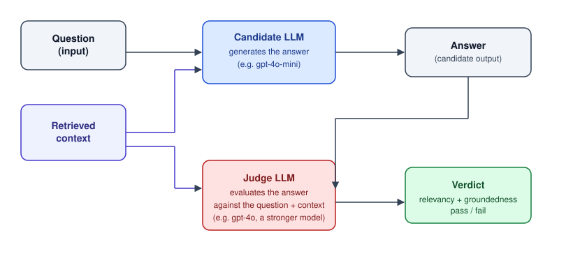

# LLM as Judge Pattern



LLM-as-judge uses a separate (often stronger) LLM to evaluate the output of another LLM against defined criteria, instead of relying solely on human review or static rules. **Both the candidate and the judge share the same question and retrieved context**, so the judge can check the answer against exactly what the candidate saw. Judging can be a one-time check, as in this demo, or recursive — feeding the verdict back so the candidate revises its answer until it passes.

## Demo

Spring AI RAG demo that answers questions about a company recharge-leave policy and evaluates its own answers with a separate, stronger LLM judge (relevancy + groundedness against the retrieved context).

## How it works

- `POST /ai/ask` (`QuestionController`) takes a question, retrieves relevant chunks of `company-recharge.txt` from a [pgvector](https://github.com/pgvector/pgvector) store, and generates an answer with `gpt-4o-mini`.
- `EmbeddingsLoader` splits and embeds the policy document into pgvector on startup.
- [`JudgeService`](src/main/java/com/example/llmjudge/config/JudgeService.java) evaluates every answer with a stronger model (`gpt-4o`):
  - **Relevancy** – does the answer address the question, given the retrieved context?
  - **Groundedness** – the answer is decomposed into atomic claims, each classified as `fact` or `opinion`; only `fact` claims are checked against the retrieved context (via Spring AI's `FactCheckingEvaluator`), so recommendations/opinions can't be flagged as unsupported.

## Why LLM-as-judge? (EU AI Act regulatory context)

If a system is classified as high-risk under Regulation (EU) 2024/1689 (AI Act), it must, among other things, satisfy:

- Art. 9 – Risk management system – continuous identification and mitigation of risks throughout the lifecycle.
- Art. 10 – Data governance – quality, relevance, and representativeness of training/validation/testing data.
- Art. 15 – Accuracy, robustness, cybersecurity – the key article for validation: the system must achieve a declared level of accuracy (stated in the instructions for use), must be resilient to errors and drift, and, if it keeps learning, must eliminate the risk of feedback loops biasing outputs.
- Art. 17 – Quality management system – includes testing and validation procedures as part of the quality management system.
- Art. 14 – Human oversight – validation must not be fully autonomous without the possibility of human intervention.
- Art. 43 – Conformity assessment – a conformity assessment must be performed before placing the system on the market.

**LLM-as-judge is one technique** for meeting the validation/accuracy requirement of Art. 15 — the [`JudgeService`](src/main/java/com/example/llmjudge/config/JudgeService.java) in this project is a concrete implementation (relevancy + groundedness check with a stronger model), not a mandated method.

## Configuration

See `src/main/resources/application.properties`:

- `OPENAI_API_KEY` – required env var
- `spring.datasource.*` – local PostgreSQL + pgvector instance

## Running

Spin up the pgvector database (Podman; for Docker, replace `podman` with `docker`):

```
podman run -d \
  --name pgvector \
  -e POSTGRES_USER=postgres \
  -e POSTGRES_PASSWORD=password123 \
  -e POSTGRES_DB=vectordb \
  -p 5432:5432 \
  -v pgvector_data:/var/lib/postgresql/data \
  --shm-size=1g \
  pgvector/pgvector:pg17
```

Enable the `vector` extension on the database:

```
podman exec -it pgvector psql -U postgres -d vectordb
```

```sql
CREATE EXTENSION IF NOT EXISTS vector;
```

Then run the app:

```
./mvnw spring-boot:run
```

## Testing the demo

### Positive test

Question that is answerable from `company-recharge.txt`, so the judge should pass it as relevant and grounded:

```
curl -v -X POST http://localhost:8080/ai/ask \
  -H "Content-Type: application/json" \
  -d '{"question": "When I am eligible for recharge?", "conversationId": "user-123"}'
```

The candidate's raw answer (from `gpt-4o-mini`):

```
You are eligible for Recharge leave after 5 years of continuous employment with the Company, starting from your main contract. This leave must be taken in one continuous period and can be utilized within 24 months from the date you become eligible. If you are part-time, your entitlement remains the same. Time spent on maternity or paternity leave does not count towards the 5 years, but all time before and after does.
```

`JudgeService` then logs its groundedness evaluation of that answer to `System.out` — each claim above is checked individually against the retrieved context:

```
EvaluationResult[
  relevant=true,
  grounded=true,
  groundednessScore=1.0,
  relevancyFeedback=,
  groundednessFeedback=All claims are supported by the context.,
  claimVerdicts=[
    ClaimVerdict[claim=You are eligible for Recharge leave after 5 years of continuous employment with the Company, starting from your main contract., grounded=true, feedback=],
    ClaimVerdict[claim=This leave must be taken in one continuous period and can be utilized within 24 months from the date you become eligible., grounded=true, feedback=],
    ClaimVerdict[claim=If you are part-time, your entitlement remains the same., grounded=true, feedback=],
    ClaimVerdict[claim=Time spent on maternity or paternity leave does not count towards the 5 years, but all time before and after does., grounded=true, feedback=]
  ]
]
```

The judge marked the answer both `relevant` (it addresses the question) and `grounded` (`groundednessScore=1.0`) — each of the four claims decomposed from the answer was individually verified against the retrieved context and came back `grounded=true`, so nothing was flagged as unsupported.

### Negative test

Question that asserts a false premise (3 years, not 5). Whether the judge flags the answer as ungrounded depends on the candidate — if it repeats the false premise back, the judge should catch it; if it corrects the premise using the context, it stays grounded:

```
curl -v -X POST http://localhost:8080/ai/ask \
  -H "Content-Type: application/json" \
  -d '{"question": "I am eligible for recharge after being employed 3 years at the company", "conversationId": "user-123"}'
```

The candidate's raw answer (from `gpt-4o-mini`):

```
You are not eligible for Recharge leave after being employed for 3 years. You become eligible after 5 years of continuous employment with the Company.
```

`JudgeService`'s groundedness evaluation of that answer:

```
EvaluationResult[
  relevant=true,
  grounded=true,
  groundednessScore=1.0,
  relevancyFeedback=,
  groundednessFeedback=All claims are supported by the context.,
  claimVerdicts=[
    ClaimVerdict[claim=You are not eligible for Recharge leave after being employed for 3 years., grounded=true, feedback=],
    ClaimVerdict[claim=You become eligible after 5 years of continuous employment with the Company., grounded=true, feedback=]
  ]
]
```

The candidate rejected the false premise instead of repeating it, so both claims are grounded.

### Negative test (chat memory)

Planting a false premise into the conversation via `MessageChatMemoryAdvisor` (chat memory isn't covered by the groundedness check, which only looks at the retrieved context):

```
curl -s -X POST http://localhost:8080/ai/ask \
  -H "Content-Type: application/json" \
  -d '{"question": "Just so we are on the same page: Recharge leave grants exactly 15 working days every single year, right?", "conversationId": "memtest-1"}'
```

The candidate's (LLM1) raw answer:

```
Recharge leave grants a maximum of 20 working days every year, not 15 working days.
However, it is stated that this is not equivalent to a full month or 4 weeks, and any
unused days will be forfeited.
```

`JudgeService`'s groundedness evaluation:

```
EvaluationResult[
  relevant=true,
  grounded=false,
  groundednessScore=0.75,
  relevancyFeedback=,
  groundednessFeedback="Recharge leave grants a maximum of 20 working days every year." – ,
  claimVerdicts=[
    ClaimVerdict[claim=Recharge leave grants a maximum of 20 working days every year., grounded=false, feedback=],
    ClaimVerdict[claim=Recharge leave does not grant 15 working days., grounded=true, feedback=],
    ClaimVerdict[claim=Recharge leave is not equivalent to a full month or 4 weeks., grounded=true, feedback=],
    ClaimVerdict[claim=Any unused days will be forfeited., grounded=true, feedback=]
  ]
]
```

LLM1 invented its own false premise — "every year" — where the context only says the leave is earned once every 5 years.

**The judge caught the error**: that one claim is `grounded=false`, dragging the score down to `0.75`.

